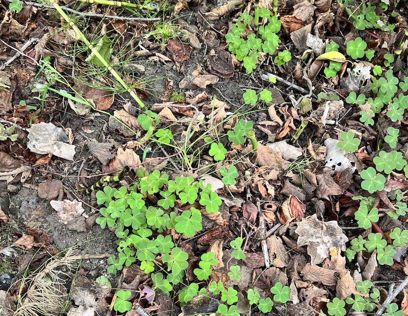
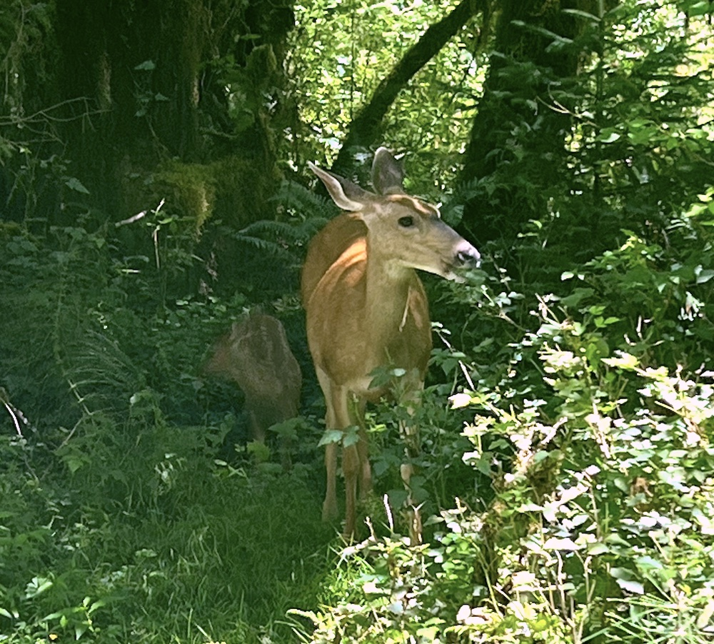
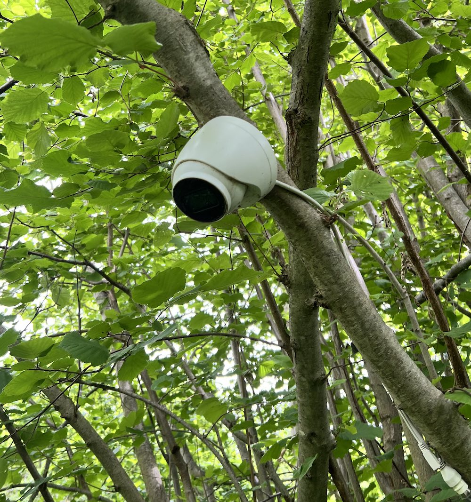
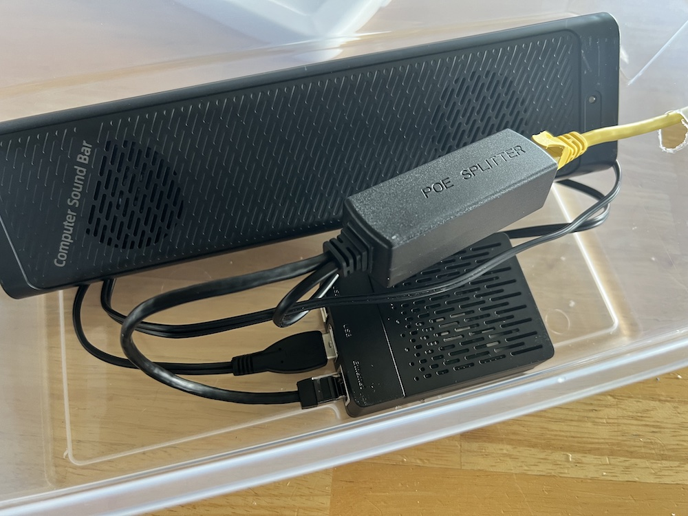
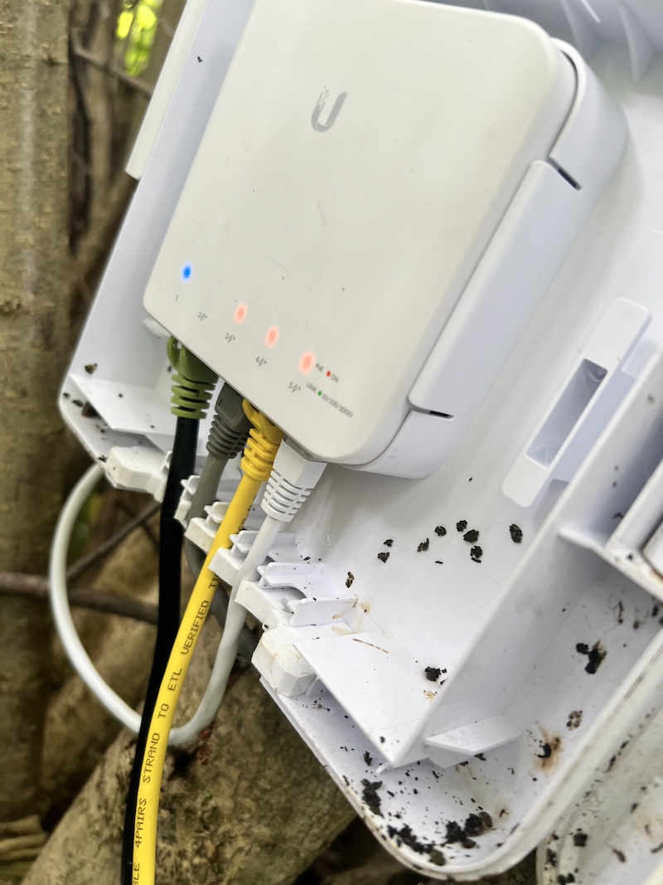

# AI Garden Watcher

Uses [Computer Vision](https://pypi.org/project/groundlight/) to keep an automated
eye on your garden.  If it detects any animals in the scene, and if it sees one it 
plays a sound of a barking dog.

## Motivation

I'm trying to establish woodsorrel clovers as a beautiful groundcover.  But I'm having trouble getting them established.  Because deer keeping eating them.  So I set up a raspberry pi with a loudspeaker and a camera to bark at the deer.  It's all running on power-over-ethernet.

[](./media/needs-protecting.jpeg)
[](./media/the-enemy.jpeg)
[](./media/our-tool.jpeg)
[](./media/the-tech.jpeg)
[](./media/poe.jpeg)


# Setting up

## Installing python dependencies

```
pip3 install -r requirements.txt
```

## Camera configuration and preview

You need to customize the `framegrab.yaml` file to point to the correct camera.
See [framegrab](https://github.com/groundlight/framegrab) for reference, but this
file is a pretty good starting point.  It can use a local Raspberry Pi or USB camera,
or most any networked RTSP camera.  

You can check that the camera code is all working properly by seeing a preview in
your terminal (if you have an advanced terminal program such as
[iTerm2](https://iterm2.com/)).

```
python trycamera.py
```


## Checking the sound

Make sure the sound is working properly:

```
python dogsound.py
```

If you'd like a different sound, just install a new `.mp3` file.


## Groundlight account setup

You can use a free Groundlight account.  Then get an
[API token](https://code.groundlight.ai/python-sdk/docs/getting-started/api-tokens) and save it as an environment variable:

```
export GROUNDLIGHT_API_TOKEN="api_..."
```


## Running the real thing

```
python app.py
```

You might want to edit the motion detection parameters to make it more or less sensitive.


## Hardware

I used a Raspberry Pi 4 with a camera module.  It will work anywhere you have the right python
and libraries installed.  I used Groundlight's [pre-built Raspberry Pi image](https://github.com/groundlight/groundlight-pi-gen).
